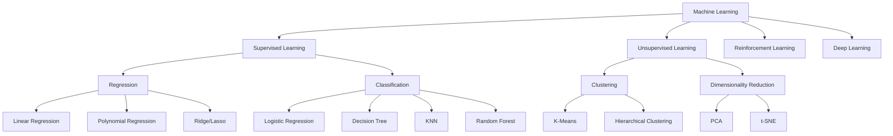

# 🤖 Machine Learning Classification Projects

<div align="center">

[](https://www.python.org/)
[](https://scikit-learn.org/)
[](https://opensource.org/licenses/MIT)
[](CONTRIBUTING.md)

*A complete learning repository for machine learning classification concepts, algorithms, and practical examples.*

[🚀 Quick Start](#-quick-start) • [📚 Concepts](#-machine-learning-concepts) • [🌳 Hierarchy](#-machine-learning-hierarchy)

</div>

---

## 📋 Table of Contents

- [🎯 Overview](#-overview)
- [📚 Machine Learning Concepts](#-machine-learning-concepts)
- [🌳 Machine Learning Hierarchy](#-machine-learning-hierarchy)
- [✨ Features](#-features)
- [🏗️ Project Structure](#-project-structure)
- [🛠️ Installation](#-installation)
- [🚀 Quick Start](#-quick-start)
- [📊 Projects](#-projects)
- [📚 Documentation](#-documentation)
- [🎓 Learning Outcomes](#-learning-outcomes)
- [🔧 Technologies Used](#-technologies-used)
- [🤝 Contributing](#-contributing)
- [📝 License](#-license)
- [📞 Contact](#-contact)

---

## 🎯 Overview

This repository is dedicated to machine learning classification projects and learning resources. It is designed to teach the core concepts of machine learning with a strong emphasis on classification, while also providing clear explanations of the broader field.

The goal is to help learners understand the fundamentals, explore real examples, and apply model building best practices in a clean and well-organized structure.

### 🎯 Target Audience
- **Students** learning machine learning fundamentals
- **Developers** building classification systems
- **Data Scientists** experimenting with algorithms
- **Educators** preparing teaching material

---

## 📚 Machine Learning Concepts

### What is Machine Learning?

Machine learning (ML) is the science of teaching computers to make decisions and predictions using data. Instead of writing explicit rules, ML models learn patterns from examples and apply those patterns to new situations.

### Why use Machine Learning?

Machine learning is used when problems are too complex to solve with fixed rules. It is especially powerful for:

- Recognizing images, speech, and text
- Predicting user behavior and outcomes
- Detecting fraud and anomalies
- Recommending products and content
- Automating repetitive decision tasks
- Learning from large and evolving datasets

### Where is Machine Learning used?

- **Healthcare**: diagnosis, treatment recommendation, medical imaging
- **Finance**: credit scoring, fraud detection, investment prediction
- **Retail**: recommendation engines, inventory forecasting, customer segmentation
- **Manufacturing**: predictive maintenance, quality inspection, process automation
- **Transportation**: route planning, self-driving systems, logistics optimization
- **Marketing**: targeting, personalization, campaign analysis
- **NLP**: chatbots, text classification, translation
- **Computer Vision**: image recognition, object detection, video analytics

### How does Machine Learning work?

A typical machine learning workflow includes:

1. **Collect data**: Gather raw examples from sources.
2. **Prepare data**: Clean, transform, and select useful features.
3. **Choose a model**: Pick an algorithm for the problem type.
4. **Train the model**: Fit the algorithm to the training data.
5. **Validate performance**: Evaluate on unseen test data.
6. **Deploy**: Use the model in real applications.
7. **Monitor and improve**: Track performance and retrain when needed.

### Key points of Machine Learning

- **Data-driven**: ML learns directly from examples.
- **Predictive power**: ML makes forecasts and classification decisions.
- **Generalization**: Models should work well on new, unseen data.
- **Feature engineering**: Choosing the right inputs is critical.
- **Evaluation**: Accuracy, precision, recall, F1-score, RMSE, and AUC are essential.
- **Bias-variance tradeoff**: Balance model complexity and generalization.
- **Automation**: ML reduces manual rule creation.
- **Iterative process**: Better results come from tuning and retraining.

---

## 🌳 Machine Learning Hierarchy

```
Machine Learning
│
├── Supervised Learning
│   │
│   ├── Regression
│   │   ├── Linear Regression
│   │   ├── Polynomial Regression
│   │   ├── Ridge Regression
│   │   ├── Lasso Regression
│   │   ├── Decision Tree Regression
│   │   └── Support Vector Regression
│   │
│   ├── Classification
│   │   ├── Logistic Regression
│   │   ├── Decision Tree
│   │   ├── K-Nearest Neighbors (KNN)
│   │   ├── Random Forest
│   │   ├── Support Vector Machine (SVM)
│   │   ├── Naive Bayes
│   │   └── Neural Networks
│   │
│   └── Semi-Supervised Learning
│       ├── Self-Training
│       ├── Co-Training
│       └── Graph-Based Methods
│
├── Unsupervised Learning
│   │
│   ├── Clustering
│   │   ├── K-Means
│   │   ├── Hierarchical Clustering
│   │   ├── DBSCAN
│   │   └── Gaussian Mixture Models
│   │
│   ├── Dimensionality Reduction
│   │   ├── PCA
│   │   ├── t-SNE
│   │   └── UMAP
│   │
│   ├── Association Rules
│   │   ├── Apriori
│   │   └── Eclat
│   │
│   └── Anomaly Detection
│       ├── Isolation Forest
│       └── One-Class SVM
│
├── Reinforcement Learning
│   │
│   ├── Value-Based Methods
│   │   ├── Q-Learning
│   │   └── Deep Q-Networks (DQN)
│   │
│   ├── Policy-Based Methods
│   │   ├── REINFORCE
│   │   └── Actor-Critic
│   │
│   └── Model-Based Methods
│       ├── Planning
│       └── Simulation
│
└── Deep Learning
    │
    ├── Neural Networks
    │   ├── Feedforward Networks
    │   ├── Convolutional Neural Networks (CNN)
    │   └── Recurrent Neural Networks (RNN)
    │
    ├── Transformers
    │   ├── BERT
    │   └── GPT
    │
    └── Generative Models
        ├── GANs
        └── Autoencoders
```

## 📈 Machine Learning Visual Summary

The main machine learning categories and their core purposes are:

- **Supervised Learning**: learns patterns from labeled data.
- **Unsupervised Learning**: discovers structure in unlabeled data.
- **Reinforcement Learning**: learns optimal actions through reward.
- **Deep Learning**: uses deep neural networks for complex problems.

### Supervised vs Unsupervised vs Reinforcement

| Category | What it learns | Example goal | Main methods |
|---|---|---|---|
| Supervised | Known labels | Predict house price or class label | Regression, Classification |
| Unsupervised | Hidden structure | Group customers or reduce dimensions | Clustering, Association, Anomaly Detection |
| Reinforcement | Action policy | Train an agent to win a game | Q-Learning, Policy Gradient |
| Deep Learning | Complex feature hierarchies | Image, text, speech understanding | CNN, RNN, Transformer |

### Regression vs Classification

- **Regression** predicts a continuous number.
  - Example: predict temperature, price, or salary.
  - Common algorithms: Linear Regression, Polynomial Regression, Ridge, Lasso.
- **Classification** predicts a discrete category.
  - Example: classify email as spam or not spam.
  - Common algorithms: Logistic Regression, Decision Tree, KNN, Random Forest, SVM.



### Supervised Learning

Supervised learning uses labeled data where the desired outcome is known. The model learns the mapping between inputs and outputs.

- **Regression** predicts continuous values.
- **Classification** predicts categories or classes.
- **Semi-supervised** combines labeled and unlabeled data.

### Unsupervised Learning

Unsupervised learning finds patterns in unlabeled data.

- **Clustering** groups similar examples.
- **Dimensionality reduction** simplifies data while preserving structure.
- **Association rules** discover relationships between variables.
- **Anomaly detection** finds unusual behavior.

### Reinforcement Learning

Reinforcement learning teaches an agent to act by maximizing cumulative reward through exploration and feedback.

- **Value-based** methods estimate the value of actions.
- **Policy-based** methods learn a direct decision policy.
- **Model-based** methods simulate the environment.

### Deep Learning

Deep learning is a specialized area of ML using multi-layer neural networks. It is especially effective for complex data like images, text, and audio.

- **CNNs** for image and spatial data.
- **RNNs** for sequential data.
- **Transformers** for language and attention-based processing.
- **GANs/Autoencoders** for generation and feature learning.

---

## ✨ Features

- ✅ **Concept-first learning** with clear machine learning theory
- ✅ **Hands-on classification examples** using real datasets
- ✅ **Rich documentation** for theory and practical use
- ✅ **Algorithm comparison** through code and results
- ✅ **Clean structure** for easy navigation
- ✅ **Visual and textual explanation** to support learning

---

## 🏗️ Project Structure

```
Machine_learning/
├── classification/
│   ├── classification_1.py      # Iris Dataset Classification
│   ├── classification_2.py      # Wine Dataset Classification
│   ├── classification_3.py      # Breast Cancer Classification
│   ├── classification_4.py      # Digits Classification
│   ├── classification_5.py      # Wine Classification with SVM
│   ├── visulize_prob_1.py       # Data Visualization
│   └── docs/                    # Comprehensive Documentation
│       ├── classification_guide.md
│       ├── chapter_01_classification_process.md
│       ├── chapter_02_code_review.md
│       └── ...
├── README.md                    # This file
├── CONTRIBUTING.md              # Contribution guide
├── LICENSE                      # MIT license
├── requirements-dev.txt         # Development dependencies
└── requirements.txt             # Runtime dependencies
```

---

## 📊 Projects

### 📁 Classification Projects Overview

| Project | Dataset | Algorithm | Classes | Features | Difficulty |
|---------|---------|-----------|---------|----------|------------|
| [1](classification/classification_1.py) | Iris | KNN | 3 | 4 | 🟢 Beginner |
| [2](classification/classification_2.py) | Wine | KNN | 3 | 13 | 🟡 Intermediate |
| [3](classification/classification_3.py) | Breast Cancer | KNN | 2 | 30 | 🟡 Intermediate |
| [4](classification/classification_4.py) | Digits | KNN | 10 | 64 | 🟠 Advanced |
| [5](classification/classification_5.py) | Wine | SVM | 3 | 13 | 🟠 Advanced |

---

## 📚 Documentation

This repository includes supporting documentation in `classification/docs/` for:

- Classification theory and process
- Code review and explanation
- Dataset analysis and preprocessing
- Model evaluation and optimization

---

## 🎓 Learning Outcomes

By using this repository, you will learn how to:

- Understand machine learning concepts and terminology
- Prepare data for classification problems
- Train and evaluate classification models
- Interpret model results using metrics
- Build reproducible machine learning workflows

---

## 🔧 Technologies Used

- Python
- scikit-learn
- pandas
- numpy
- matplotlib
- seaborn

---

## 🤝 Contributing

Contributions are welcome! Please review `CONTRIBUTING.md` before submitting changes.

---

## 📝 License

This project is licensed under the MIT License. See `LICENSE` for details.

---

## 📞 Contact

If you want to collaborate, file an issue, or ask a question, please open a GitHub issue or connect through the repository.
