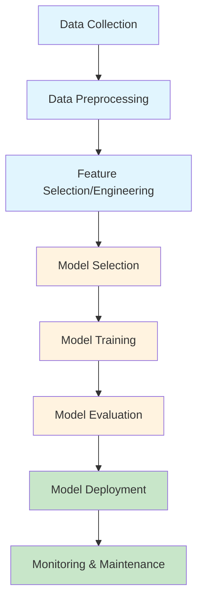
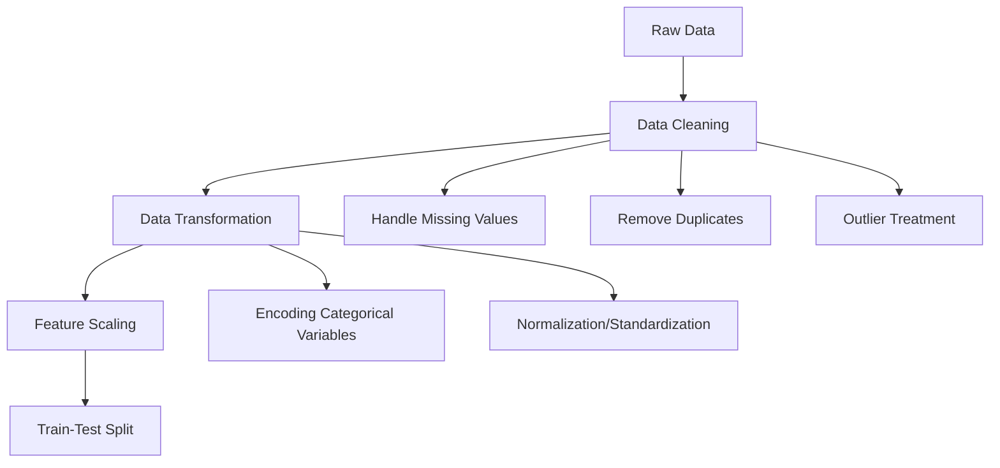
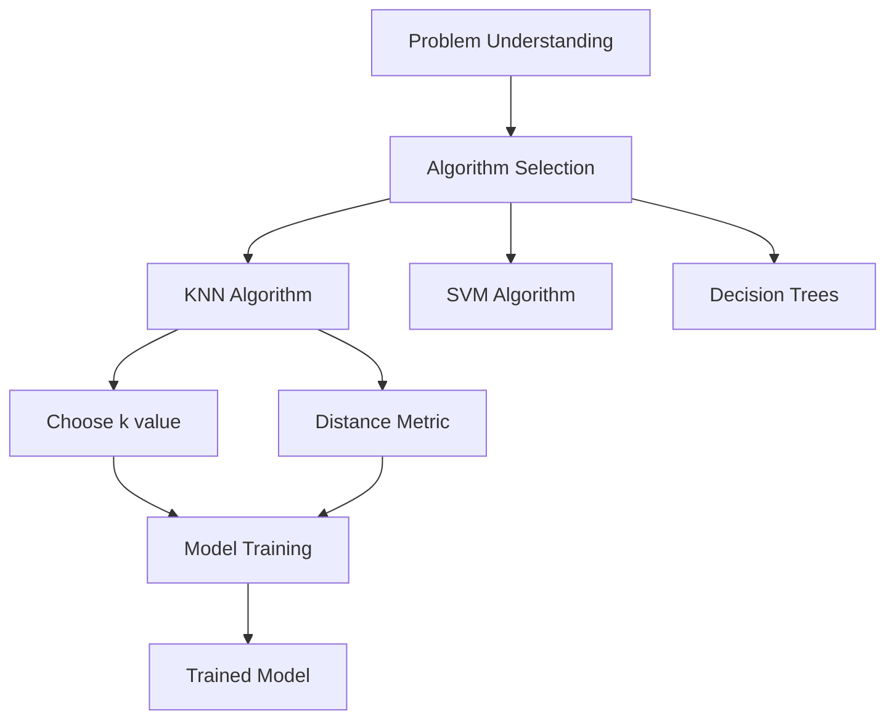
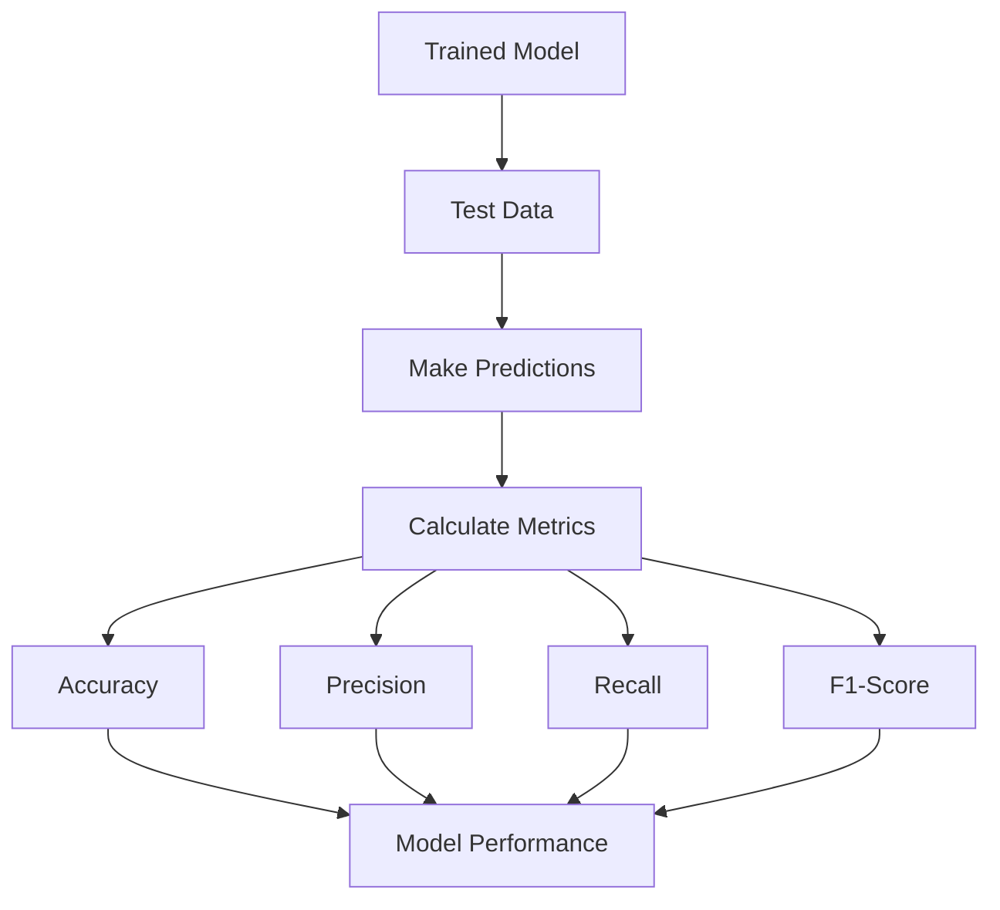
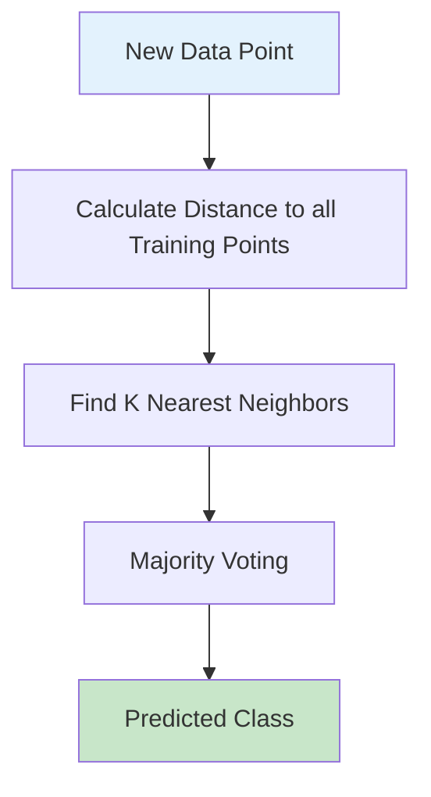
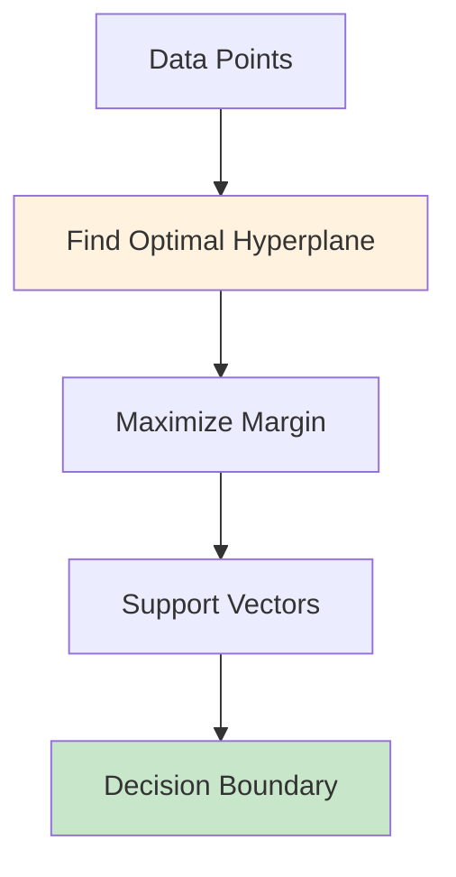
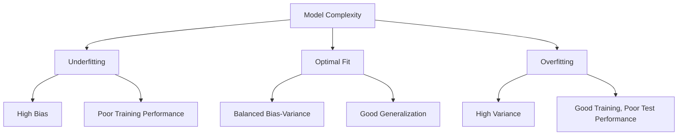

# Chapter 1: Understanding the Classification Process

## 1.1 What is Classification?

Classification is a supervised machine learning technique used to categorize data points into predefined classes or categories. In supervised learning, we train a model using labeled data (data with known outcomes) to predict the class of new, unseen data.

**Key Characteristics:**
- **Supervised Learning**: Uses labeled training data
- **Categorical Output**: Predicts discrete class labels
- **Decision Boundaries**: Creates boundaries to separate different classes

## 1.2 The Machine Learning Workflow



## 1.3 Detailed Classification Process

### Step 1: Data Collection
- Gather relevant data for the problem
- Ensure data quality and representativeness
- Handle missing values and outliers

### Step 2: Data Preprocessing


### Step 3: Model Selection and Training


### Step 4: Model Evaluation


## 1.4 Common Classification Algorithms

### K-Nearest Neighbors (KNN)


**How KNN Works:**
1. Choose k (number of neighbors)
2. Calculate distance from new point to all training points
3. Find k closest points
4. Assign class based on majority vote

**Pros:** Simple, no training phase, works well with small datasets
**Cons:** Slow for large datasets, sensitive to irrelevant features

### Support Vector Machine (SVM)


**How SVM Works:**
1. Find the hyperplane that best separates classes
2. Maximize the margin between classes
3. Use support vectors to define the boundary

## 1.5 Evaluation Metrics

### Confusion Matrix
```
Predicted →    Negative    Positive
Actual ↓
Negative        TN          FP
Positive        FN          TP
```

### Key Metrics
- **Accuracy**: (TP + TN) / (TP + TN + FP + FN)
- **Precision**: TP / (TP + FP)
- **Recall**: TP / (TP + FN)
- **F1-Score**: 2 * (Precision * Recall) / (Precision + Recall)

## 1.6 Overfitting vs Underfitting



## 1.7 Best Practices

1. **Data Quality**: Clean, representative data is crucial
2. **Feature Engineering**: Select relevant features
3. **Cross-Validation**: Use k-fold CV for robust evaluation
4. **Hyperparameter Tuning**: Optimize model parameters
5. **Model Interpretability**: Understand model decisions
6. **Scalability**: Consider computational requirements

---

**[← Back to Main Guide](../classification_guide.md)** | **[Next: Chapter 2 →](chapter_02_code_review.md)**