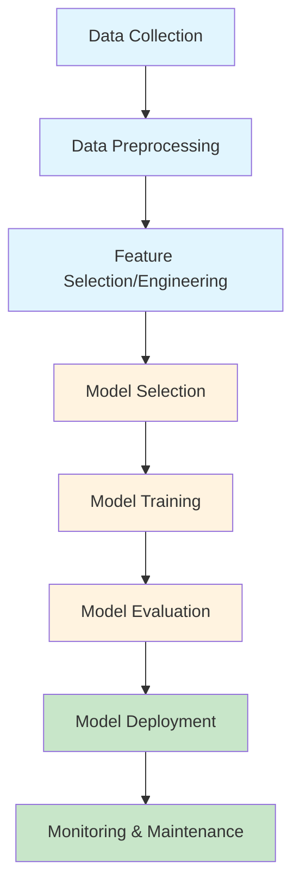
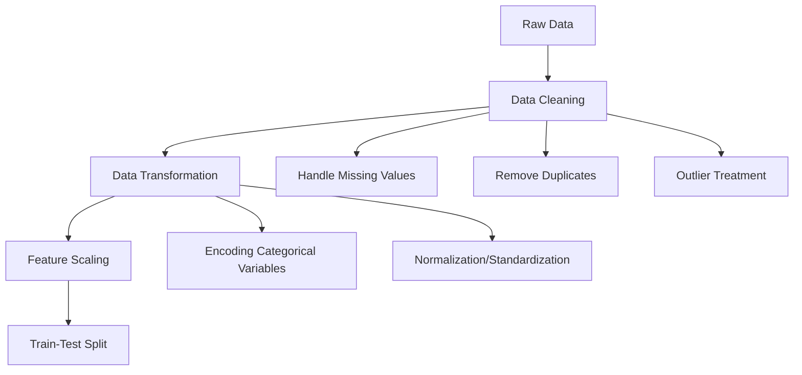
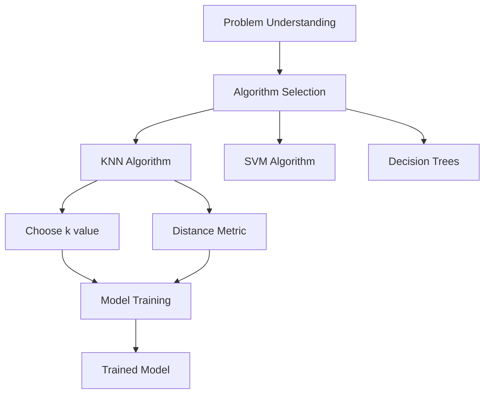
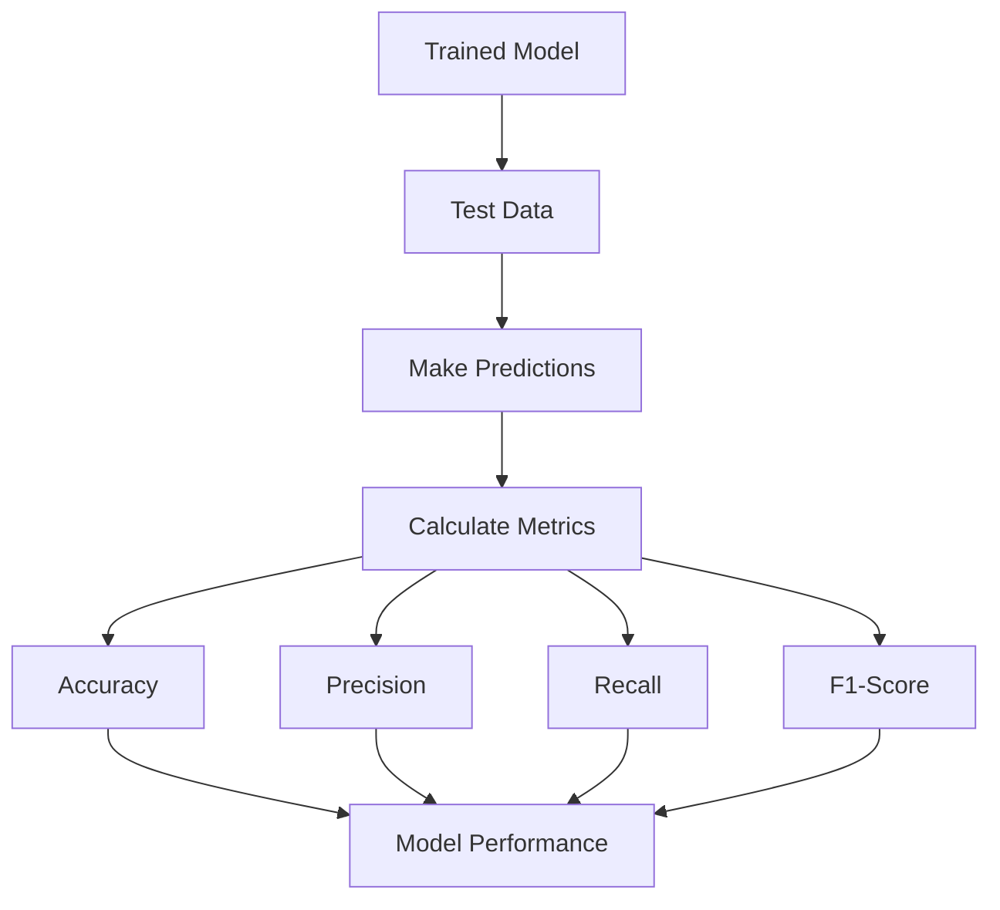
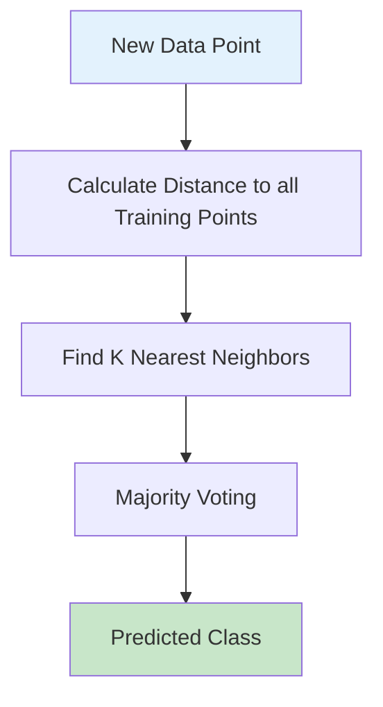
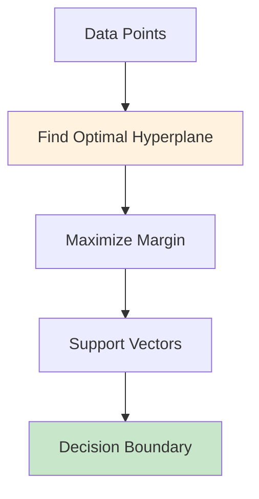
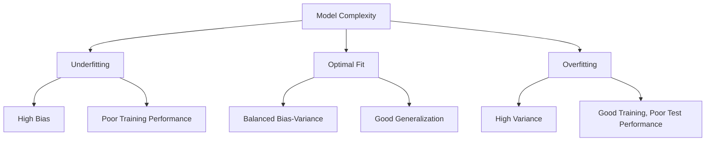

# Classification Projects Guide

## Chapter 1: Understanding the Classification Process

### 1.1 What is Classification?

Classification is a supervised machine learning technique used to categorize data points into predefined classes or categories. In supervised learning, we train a model using labeled data (data with known outcomes) to predict the class of new, unseen data.

**Key Characteristics:**
- **Supervised Learning**: Uses labeled training data
- **Categorical Output**: Predicts discrete class labels
- **Decision Boundaries**: Creates boundaries to separate different classes

### 1.2 The Machine Learning Workflow



### 1.3 Detailed Classification Process

#### Step 1: Data Collection
- Gather relevant data for the problem
- Ensure data quality and representativeness
- Handle missing values and outliers

#### Step 2: Data Preprocessing


#### Step 3: Model Selection and Training


#### Step 4: Model Evaluation


### 1.4 Common Classification Algorithms

#### K-Nearest Neighbors (KNN)


**How KNN Works:**
1. Choose k (number of neighbors)
2. Calculate distance from new point to all training points
3. Find k closest points
4. Assign class based on majority vote

**Pros:** Simple, no training phase, works well with small datasets
**Cons:** Slow for large datasets, sensitive to irrelevant features

#### Support Vector Machine (SVM)


**How SVM Works:**
1. Find the hyperplane that best separates classes
2. Maximize the margin between classes
3. Use support vectors to define the boundary

### 1.5 Evaluation Metrics

#### Confusion Matrix
```
Predicted →    Negative    Positive
Actual ↓
Negative        TN          FP
Positive        FN          TP
```

#### Key Metrics
- **Accuracy**: (TP + TN) / (TP + TN + FP + FN)
- **Precision**: TP / (TP + FP)
- **Recall**: TP / (TP + FN)
- **F1-Score**: 2 * (Precision * Recall) / (Precision + Recall)

### 1.6 Overfitting vs Underfitting



### 1.7 Best Practices

1. **Data Quality**: Clean, representative data is crucial
2. **Feature Engineering**: Select relevant features
3. **Cross-Validation**: Use k-fold CV for robust evaluation
4. **Hyperparameter Tuning**: Optimize model parameters
5. **Model Interpretability**: Understand model decisions
6. **Scalability**: Consider computational requirements

---

## Chapter 2: Code Review and Analysis

### 2.1 Project Overview

This chapter provides a detailed code review of all classification projects, analyzing code quality, best practices, and potential improvements.

### 2.2 Project 1: Iris Classification (`classificaton_1.py`)

#### Code Structure
```python
import pandas as pd
import matplotlib.pyplot as plt
import seaborn as sns

from sklearn.datasets import load_iris
from sklearn.model_selection import train_test_split
from sklearn.neighbors import KNeighborsClassifier
from sklearn.metrics import accuracy_score

iris = load_iris()
df = pd.DataFrame(data=iris.data, columns=iris.feature_names)
df['target'] = iris.target
# print(df.head())  # Commented out
x = df.drop('target', axis=1)
y = df['target']

X_train, X_test, Y_train, Y_test = train_test_split(x, y, test_size=0.2)

knn = KNeighborsClassifier(n_neighbors=3)

knn.fit(X_train, Y_train)
pred = knn.predict(X_test)

acc = accuracy_score(Y_test, pred)
```

#### Strengths
- Clean and simple implementation
- Proper use of pandas for data manipulation
- Correct train-test split
- Appropriate use of KNN for small dataset

#### Areas for Improvement
- **Reproducibility**: No `random_state` in train_test_split
- **Output**: No print statements to show results
- **Error Handling**: No validation of data loading
- **Comments**: Minimal inline documentation
- **Variable Naming**: Could be more descriptive (x, y → features, target)

#### Recommended Improvements
```python
# Add reproducibility
X_train, X_test, Y_train, Y_test = train_test_split(x, y, test_size=0.2, random_state=42)

# Add output
print(f"Model Accuracy: {acc:.4f}")
print(f"Training samples: {len(X_train)}")
print(f"Testing samples: {len(X_test)}")
```

### 2.3 Project 2: Wine Classification (`classification_2.py`)

#### Code Structure
```python
import pandas as pd
from sklearn.datasets import load_wine
from sklearn.model_selection import train_test_split
from sklearn.neighbors import KNeighborsClassifier
from sklearn.metrics import accuracy_score

# Load the wine dataset
wine = load_wine()
df = pd.DataFrame(data=wine.data, columns=wine.feature_names)
df['target'] = wine.target

# Features and target
x = df.drop('target', axis=1)
y = df['target']

# Split the data
X_train, X_test, Y_train, Y_test = train_test_split(x, y, test_size=0.2, random_state=42)

# Create KNN classifier
knn = KNeighborsClassifier(n_neighbors=3)

# Train the model
knn.fit(X_train, Y_train)

# Make predictions
pred = knn.predict(X_test)

# Calculate accuracy
acc = accuracy_score(Y_test, pred)
print(f"Accuracy: {acc:.2f}")

# Optional: Print some predictions
print("Sample predictions:")
for i in range(5):
    print(f"Predicted: {pred[i]}, Actual: {Y_test.iloc[i]}")
```

#### Strengths
- Excellent commenting throughout
- Reproducible results with `random_state`
- Clear output formatting
- Good variable naming
- Includes sample predictions for verification

#### Areas for Improvement
- **Data Exploration**: No initial data analysis
- **Feature Scaling**: Wine features have different scales, KNN is distance-based
- **Cross-Validation**: Single train-test split may not be robust
- **Additional Metrics**: Only accuracy, could add precision/recall

#### Recommended Improvements
```python
# Add data exploration
print(f"Dataset shape: {df.shape}")
print(f"Feature names: {wine.feature_names}")
print(f"Target names: {wine.target_names}")

# Add feature scaling for KNN
from sklearn.preprocessing import StandardScaler
scaler = StandardScaler()
X_train_scaled = scaler.fit_transform(X_train)
X_test_scaled = scaler.transform(X_test)
knn.fit(X_train_scaled, Y_train)
```

### 2.4 Project 3: Breast Cancer Classification (`classification_3.py`)

#### Code Structure
Similar to Project 2, using `load_breast_cancer()`.

#### Strengths
- Consistent structure with Project 2
- Good commenting
- Reproducible results

#### Key Differences
- Binary classification (2 classes vs 3)
- Medical dataset context
- Higher dimensional feature space (30 features)

#### Areas for Improvement
- **Class Balance**: Check if classes are balanced
- **Feature Importance**: With 30 features, some analysis would be valuable
- **Model Comparison**: Could compare with other algorithms

#### Recommended Improvements
```python
# Check class distribution
print("Class distribution:")
print(df['target'].value_counts())

# Add classification report
from sklearn.metrics import classification_report
print(classification_report(Y_test, pred))
```

### 2.5 Project 4: Digits Classification (`classification_4.py`)

#### Code Structure
Similar to previous projects, using `load_digits()`.

#### Strengths
- Handles image data appropriately
- Good for multiclass (10 classes)

#### Areas for Improvement
- **Data Visualization**: No visualization of digits
- **Preprocessing**: Pixel values could benefit from scaling
- **Confusion Matrix**: Would help understand misclassifications

#### Recommended Improvements
```python
# Visualize some digits
import matplotlib.pyplot as plt
fig, axes = plt.subplots(2, 5, figsize=(10, 5))
for i, ax in enumerate(axes.flat):
    ax.imshow(digits.images[i], cmap='gray')
    ax.set_title(f'Label: {digits.target[i]}')
plt.show()

# Add confusion matrix
from sklearn.metrics import confusion_matrix
cm = confusion_matrix(Y_test, pred)
print("Confusion Matrix:")
print(cm)
```

### 2.6 Project 5: Wine Classification with SVM (`classification_5.py`)

#### Code Structure
```python
# Create SVM classifier
svm = SVC(kernel='linear', random_state=42)

# Train the model
svm.fit(X_train, Y_train)

# Make predictions
pred = svm.predict(X_test)
```

#### Strengths
- Introduces different algorithm
- Good comparison opportunity with KNN
- Proper use of SVM parameters

#### Areas for Improvement
- **Hyperparameter Tuning**: Linear kernel may not be optimal
- **Feature Scaling**: SVM is also sensitive to feature scales
- **Performance Comparison**: Could compare SVM vs KNN results

#### Recommended Improvements
```python
# Try different kernels
kernels = ['linear', 'rbf', 'poly']
for kernel in kernels:
    svm = SVC(kernel=kernel, random_state=42)
    svm.fit(X_train, Y_train)
    pred = svm.predict(X_test)
    acc = accuracy_score(Y_test, pred)
    print(f"SVM with {kernel} kernel: {acc:.4f}")
```

### 2.7 Visualization Project (`visulize_prob_1.py`)

#### Code Structure
Uses matplotlib and seaborn for plotting.

#### Strengths
- Introduces data visualization concepts
- Uses appropriate libraries

#### Areas for Improvement
- **Integration**: Could be integrated with other projects
- **Specific Visualizations**: More targeted plots for each dataset
- **Interactive Plots**: Could use plotly for interactivity

### 2.8 Overall Code Quality Assessment

#### Positive Aspects
- Consistent code structure across projects
- Progressive complexity
- Good use of scikit-learn
- Clear separation of concerns

#### Common Issues
- Lack of data exploration and visualization
- Limited evaluation metrics
- No hyperparameter tuning
- Missing error handling
- Inconsistent output formatting

#### Recommended Enhancements
1. **Add Data Exploration Functions**
2. **Implement Cross-Validation**
3. **Include Multiple Metrics**
4. **Add Feature Scaling**
5. **Create Utility Functions**
6. **Add Logging and Error Handling**
7. **Include Model Persistence**

### 2.9 Best Practices Implementation

#### Example Enhanced Template
```python
import pandas as pd
import numpy as np
from sklearn.datasets import load_iris
from sklearn.model_selection import train_test_split, cross_val_score
from sklearn.preprocessing import StandardScaler
from sklearn.neighbors import KNeighborsClassifier
from sklearn.metrics import accuracy_score, classification_report
import matplotlib.pyplot as plt
import seaborn as sns

def load_and_explore_data():
    """Load dataset and perform initial exploration"""
    iris = load_iris()
    df = pd.DataFrame(data=iris.data, columns=iris.feature_names)
    df['target'] = iris.target

    print("Dataset Overview:")
    print(f"Shape: {df.shape}")
    print(f"Features: {iris.feature_names}")
    print(f"Classes: {iris.target_names}")

    return df, iris

def preprocess_data(df):
    """Preprocess the data"""
    X = df.drop('target', axis=1)
    y = df['target']

    # Feature scaling
    scaler = StandardScaler()
    X_scaled = scaler.fit_transform(X)

    return X_scaled, y, scaler

def train_and_evaluate_model(X_train, X_test, y_train, y_test):
    """Train model and evaluate performance"""
    model = KNeighborsClassifier(n_neighbors=3)
    model.fit(X_train, y_train)

    # Predictions
    y_pred = model.predict(X_test)

    # Evaluation
    accuracy = accuracy_score(y_test, y_pred)
    report = classification_report(y_test, y_pred)

    return model, accuracy, report, y_pred

# Main execution
if __name__ == "__main__":
    # Load and explore
    df, iris_info = load_and_explore_data()

    # Preprocess
    X, y, scaler = preprocess_data(df)

    # Split data
    X_train, X_test, y_train, y_test = train_test_split(
        X, y, test_size=0.2, random_state=42, stratify=y
    )

    # Train and evaluate
    model, accuracy, report, predictions = train_and_evaluate_model(
        X_train, X_test, y_train, y_test
    )

    # Results
    print(f"\nModel Accuracy: {accuracy:.4f}")
    print("\nClassification Report:")
    print(report)
```

This enhanced template demonstrates best practices including:
- Function decomposition
- Comprehensive evaluation
- Feature scaling
- Stratified splitting
- Detailed reporting

---

## Conclusion

This guide provides both theoretical understanding and practical code analysis for classification projects. Chapter 1 explains the machine learning process with visual flowcharts, while Chapter 2 offers detailed code reviews with improvement suggestions.

The projects demonstrate a learning progression from simple implementations to more complex scenarios, building foundational machine learning skills.