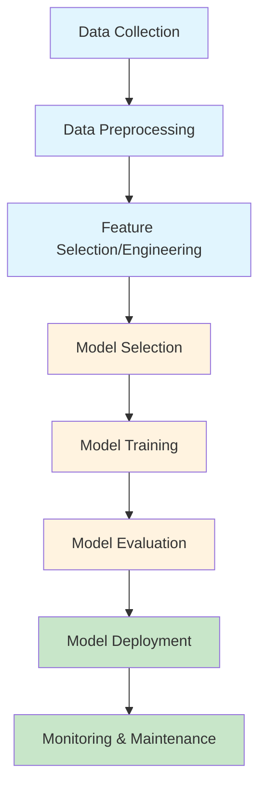
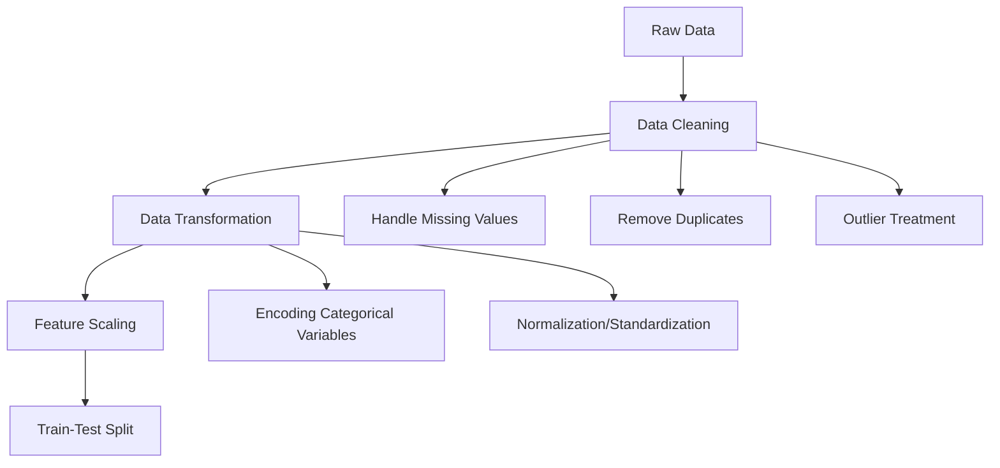
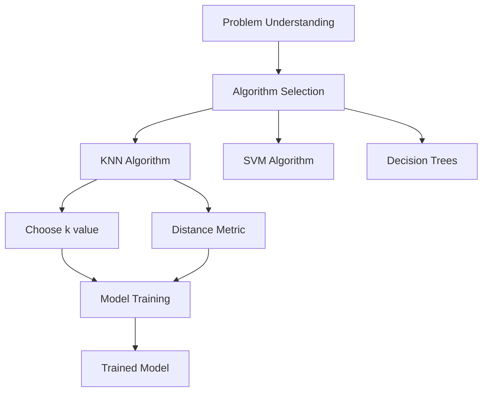
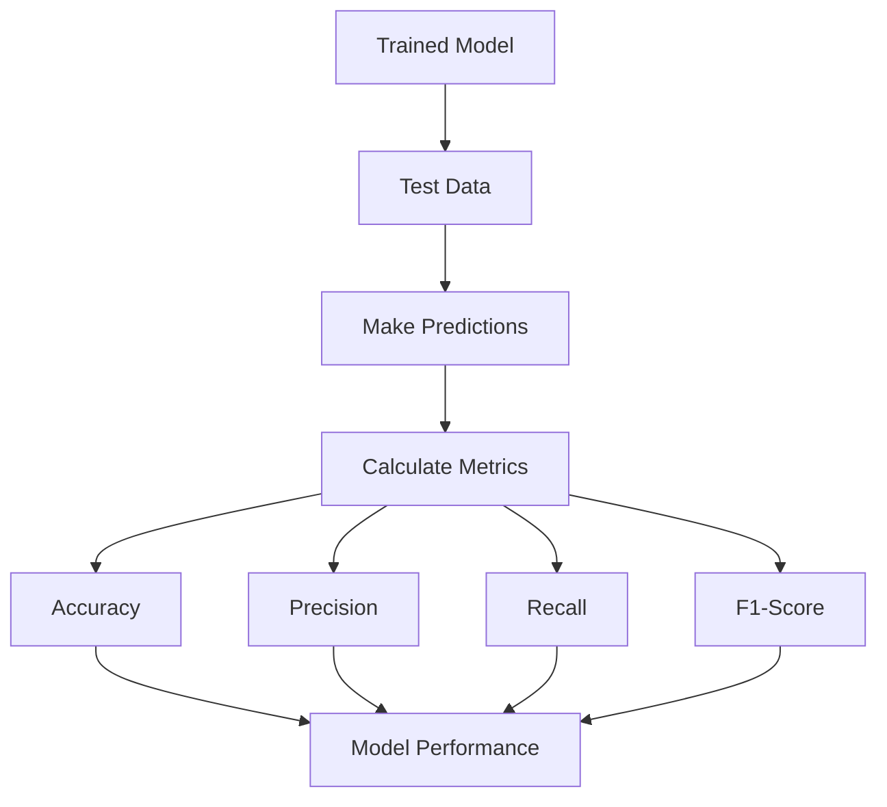
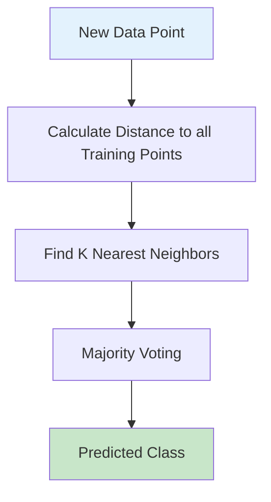
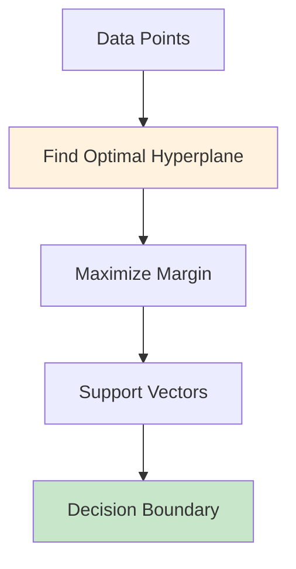
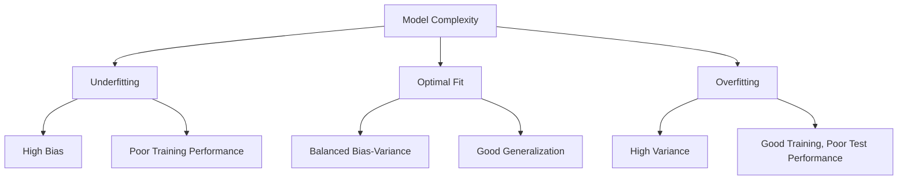

# Classification Projects Guide

## Table of Contents

### [Chapter 1: Understanding the Classification Process](chapter_01_classification_process.md)
- What is Classification?
- The Machine Learning Workflow
- Detailed Classification Process
- Common Classification Algorithms
- Evaluation Metrics
- Overfitting vs Underfitting
- Best Practices

### [Chapter 2: Code Review and Analysis](chapter_02_code_review.md)
- Project Overview
- Project 1: Iris Classification
- Project 2: Wine Classification
- Project 3: Breast Cancer Classification
- Project 4: Handwritten Digits Classification
- Project 5: Wine Classification with SVM
- Overall Code Quality Assessment
- Best Practices Implementation

### [Chapter 3: Dataset Analysis and Statistics](chapter_03_dataset_analysis.md)
- Dataset Comparison Table
- Dataset Characteristics
- Iris Dataset Details
- Wine Dataset Details
- Breast Cancer Dataset Details
- Digits Dataset Details

### [Chapter 4: Performance Analysis and Optimization](chapter_04_performance_optimization.md)
- Model Performance Comparison
- Accuracy Results
- Hyperparameter Tuning
- Cross-Validation Techniques

### [Chapter 5: Common Mistakes and Troubleshooting](chapter_05_troubleshooting.md)
- Data-Related Issues
- Algorithm-Specific Issues
- Code Quality Issues
- Solutions and Best Practices

### [Chapter 6: Advanced Topics and Extensions](chapter_06_advanced_topics.md)
- Ensemble Methods
- Feature Engineering
- Model Interpretability
- Pipeline Implementation

### [Chapter 7: Practical Applications and Case Studies](chapter_07_applications.md)
- Real-World Applications
- Industry Case Study: Email Spam Classification

### [Chapter 8: Resources and Further Reading](chapter_08_resources.md)
- Books
- Online Courses
- Documentation
- Communities

### [Chapter 9: Quick Reference Guide](chapter_09_quick_reference.md)
- Essential Code Snippets
- Model Training Template
- Cross-Validation Template
- Common Commands

## Overview

This comprehensive guide covers machine learning classification concepts through a series of progressive projects. Each chapter focuses on a specific aspect of the classification workflow, from basic concepts to advanced techniques.

The guide is organized into nine chapters, each available as a separate file for focused reading. The projects demonstrate practical implementation using scikit-learn and real datasets.

## Getting Started

1. **Beginners**: Start with Chapter 1 and work through the basic projects (1-2)
2. **Intermediate Learners**: Focus on Chapters 3-5 for optimization and troubleshooting
3. **Advanced Users**: Explore Chapters 6-7 for real-world applications
4. **Reference**: Use Chapters 8-9 for quick lookups and code templates

## Project Structure

The classification folder contains:
- `classification_1.py` to `classification_5.py` - Main project files
- `visulize_prob_1.py` - Data visualization examples
- `docs/` - Documentation folder with detailed guides

## Prerequisites

- Python 3.7+
- scikit-learn
- pandas
- numpy
- matplotlib
- seaborn

## Quick Start

```bash
# Navigate to classification folder
cd Machine_learning/classification

# Run a basic project
python classification_1.py

# Explore documentation
start docs/classification_guide.md
```

---

*This guide is designed to be both a learning resource and a reference manual for machine learning classification projects.*

### 1.1 What is Classification?

Classification is a supervised machine learning technique used to categorize data points into predefined classes or categories. In supervised learning, we train a model using labeled data (data with known outcomes) to predict the class of new, unseen data.

**Key Characteristics:**
- **Supervised Learning**: Uses labeled training data
- **Categorical Output**: Predicts discrete class labels
- **Decision Boundaries**: Creates boundaries to separate different classes

### 1.2 The Machine Learning Workflow



### 1.3 Detailed Classification Process

#### Step 1: Data Collection
- Gather relevant data for the problem
- Ensure data quality and representativeness
- Handle missing values and outliers

#### Step 2: Data Preprocessing


#### Step 3: Model Selection and Training


#### Step 4: Model Evaluation


### 1.4 Common Classification Algorithms

#### K-Nearest Neighbors (KNN)


**How KNN Works:**
1. Choose k (number of neighbors)
2. Calculate distance from new point to all training points
3. Find k closest points
4. Assign class based on majority vote

**Pros:** Simple, no training phase, works well with small datasets
**Cons:** Slow for large datasets, sensitive to irrelevant features

#### Support Vector Machine (SVM)


**How SVM Works:**
1. Find the hyperplane that best separates classes
2. Maximize the margin between classes
3. Use support vectors to define the boundary

### 1.5 Evaluation Metrics

#### Confusion Matrix
```
Predicted →    Negative    Positive
Actual ↓
Negative        TN          FP
Positive        FN          TP
```

#### Key Metrics
- **Accuracy**: (TP + TN) / (TP + TN + FP + FN)
- **Precision**: TP / (TP + FP)
- **Recall**: TP / (TP + FN)
- **F1-Score**: 2 * (Precision * Recall) / (Precision + Recall)

### 1.6 Overfitting vs Underfitting



### 1.7 Best Practices

1. **Data Quality**: Clean, representative data is crucial
2. **Feature Engineering**: Select relevant features
3. **Cross-Validation**: Use k-fold CV for robust evaluation
4. **Hyperparameter Tuning**: Optimize model parameters
5. **Model Interpretability**: Understand model decisions
6. **Scalability**: Consider computational requirements

---

## Chapter 2: Code Review and Analysis

### 2.1 Project Overview

This chapter provides a detailed code review of all classification projects, analyzing code quality, best practices, and potential improvements.

### 2.2 Project 1: Iris Classification (`classificaton_1.py`)

#### Code Structure
```python
import pandas as pd
import matplotlib.pyplot as plt
import seaborn as sns

from sklearn.datasets import load_iris
from sklearn.model_selection import train_test_split
from sklearn.neighbors import KNeighborsClassifier
from sklearn.metrics import accuracy_score

iris = load_iris()
df = pd.DataFrame(data=iris.data, columns=iris.feature_names)
df['target'] = iris.target
# print(df.head())  # Commented out
x = df.drop('target', axis=1)
y = df['target']

X_train, X_test, Y_train, Y_test = train_test_split(x, y, test_size=0.2)

knn = KNeighborsClassifier(n_neighbors=3)

knn.fit(X_train, Y_train)
pred = knn.predict(X_test)

acc = accuracy_score(Y_test, pred)
```

#### Strengths
- Clean and simple implementation
- Proper use of pandas for data manipulation
- Correct train-test split
- Appropriate use of KNN for small dataset

#### Areas for Improvement
- **Reproducibility**: No `random_state` in train_test_split
- **Output**: No print statements to show results
- **Error Handling**: No validation of data loading
- **Comments**: Minimal inline documentation
- **Variable Naming**: Could be more descriptive (x, y → features, target)

#### Recommended Improvements
```python
# Add reproducibility
X_train, X_test, Y_train, Y_test = train_test_split(x, y, test_size=0.2, random_state=42)

# Add output
print(f"Model Accuracy: {acc:.4f}")
print(f"Training samples: {len(X_train)}")
print(f"Testing samples: {len(X_test)}")
```

### 2.3 Project 2: Wine Classification (`classification_2.py`)

#### Code Structure
```python
import pandas as pd
from sklearn.datasets import load_wine
from sklearn.model_selection import train_test_split
from sklearn.neighbors import KNeighborsClassifier
from sklearn.metrics import accuracy_score

# Load the wine dataset
wine = load_wine()
df = pd.DataFrame(data=wine.data, columns=wine.feature_names)
df['target'] = wine.target

# Features and target
x = df.drop('target', axis=1)
y = df['target']

# Split the data
X_train, X_test, Y_train, Y_test = train_test_split(x, y, test_size=0.2, random_state=42)

# Create KNN classifier
knn = KNeighborsClassifier(n_neighbors=3)

# Train the model
knn.fit(X_train, Y_train)

# Make predictions
pred = knn.predict(X_test)

# Calculate accuracy
acc = accuracy_score(Y_test, pred)
print(f"Accuracy: {acc:.2f}")

# Optional: Print some predictions
print("Sample predictions:")
for i in range(5):
    print(f"Predicted: {pred[i]}, Actual: {Y_test.iloc[i]}")
```

#### Strengths
- Excellent commenting throughout
- Reproducible results with `random_state`
- Clear output formatting
- Good variable naming
- Includes sample predictions for verification

#### Areas for Improvement
- **Data Exploration**: No initial data analysis
- **Feature Scaling**: Wine features have different scales, KNN is distance-based
- **Cross-Validation**: Single train-test split may not be robust
- **Additional Metrics**: Only accuracy, could add precision/recall

#### Recommended Improvements
```python
# Add data exploration
print(f"Dataset shape: {df.shape}")
print(f"Feature names: {wine.feature_names}")
print(f"Target names: {wine.target_names}")

# Add feature scaling for KNN
from sklearn.preprocessing import StandardScaler
scaler = StandardScaler()
X_train_scaled = scaler.fit_transform(X_train)
X_test_scaled = scaler.transform(X_test)
knn.fit(X_train_scaled, Y_train)
```

### 2.4 Project 3: Breast Cancer Classification (`classification_3.py`)

#### Code Structure
Similar to Project 2, using `load_breast_cancer()`.

#### Strengths
- Consistent structure with Project 2
- Good commenting
- Reproducible results

#### Key Differences
- Binary classification (2 classes vs 3)
- Medical dataset context
- Higher dimensional feature space (30 features)

#### Areas for Improvement
- **Class Balance**: Check if classes are balanced
- **Feature Importance**: With 30 features, some analysis would be valuable
- **Model Comparison**: Could compare with other algorithms

#### Recommended Improvements
```python
# Check class distribution
print("Class distribution:")
print(df['target'].value_counts())

# Add classification report
from sklearn.metrics import classification_report
print(classification_report(Y_test, pred))
```

### 2.5 Project 4: Digits Classification (`classification_4.py`)

#### Code Structure
Similar to previous projects, using `load_digits()`.

#### Strengths
- Handles image data appropriately
- Good for multiclass (10 classes)

#### Areas for Improvement
- **Data Visualization**: No visualization of digits
- **Preprocessing**: Pixel values could benefit from scaling
- **Confusion Matrix**: Would help understand misclassifications

#### Recommended Improvements
```python
# Visualize some digits
import matplotlib.pyplot as plt
fig, axes = plt.subplots(2, 5, figsize=(10, 5))
for i, ax in enumerate(axes.flat):
    ax.imshow(digits.images[i], cmap='gray')
    ax.set_title(f'Label: {digits.target[i]}')
plt.show()

# Add confusion matrix
from sklearn.metrics import confusion_matrix
cm = confusion_matrix(Y_test, pred)
print("Confusion Matrix:")
print(cm)
```

### 2.6 Project 5: Wine Classification with SVM (`classification_5.py`)

#### Code Structure
```python
# Create SVM classifier
svm = SVC(kernel='linear', random_state=42)

# Train the model
svm.fit(X_train, Y_train)

# Make predictions
pred = svm.predict(X_test)
```

#### Strengths
- Introduces different algorithm
- Good comparison opportunity with KNN
- Proper use of SVM parameters

#### Areas for Improvement
- **Hyperparameter Tuning**: Linear kernel may not be optimal
- **Feature Scaling**: SVM is also sensitive to feature scales
- **Performance Comparison**: Could compare SVM vs KNN results

#### Recommended Improvements
```python
# Try different kernels
kernels = ['linear', 'rbf', 'poly']
for kernel in kernels:
    svm = SVC(kernel=kernel, random_state=42)
    svm.fit(X_train, Y_train)
    pred = svm.predict(X_test)
    acc = accuracy_score(Y_test, pred)
    print(f"SVM with {kernel} kernel: {acc:.4f}")
```

### 2.7 Visualization Project (`visulize_prob_1.py`)

#### Code Structure
Uses matplotlib and seaborn for plotting.

#### Strengths
- Introduces data visualization concepts
- Uses appropriate libraries

#### Areas for Improvement
- **Integration**: Could be integrated with other projects
- **Specific Visualizations**: More targeted plots for each dataset
- **Interactive Plots**: Could use plotly for interactivity

### 2.8 Overall Code Quality Assessment

#### Positive Aspects
- Consistent code structure across projects
- Progressive complexity
- Good use of scikit-learn
- Clear separation of concerns

#### Common Issues
- Lack of data exploration and visualization
- Limited evaluation metrics
- No hyperparameter tuning
- Missing error handling
- Inconsistent output formatting

#### Recommended Enhancements
1. **Add Data Exploration Functions**
2. **Implement Cross-Validation**
3. **Include Multiple Metrics**
4. **Add Feature Scaling**
5. **Create Utility Functions**
6. **Add Logging and Error Handling**
7. **Include Model Persistence**

### 2.9 Best Practices Implementation

#### Example Enhanced Template
```python
import pandas as pd
import numpy as np
from sklearn.datasets import load_iris
from sklearn.model_selection import train_test_split, cross_val_score
from sklearn.preprocessing import StandardScaler
from sklearn.neighbors import KNeighborsClassifier
from sklearn.metrics import accuracy_score, classification_report
import matplotlib.pyplot as plt
import seaborn as sns

def load_and_explore_data():
    """Load dataset and perform initial exploration"""
    iris = load_iris()
    df = pd.DataFrame(data=iris.data, columns=iris.feature_names)
    df['target'] = iris.target

    print("Dataset Overview:")
    print(f"Shape: {df.shape}")
    print(f"Features: {iris.feature_names}")
    print(f"Classes: {iris.target_names}")

    return df, iris

def preprocess_data(df):
    """Preprocess the data"""
    X = df.drop('target', axis=1)
    y = df['target']

    # Feature scaling
    scaler = StandardScaler()
    X_scaled = scaler.fit_transform(X)

    return X_scaled, y, scaler

def train_and_evaluate_model(X_train, X_test, y_train, y_test):
    """Train model and evaluate performance"""
    model = KNeighborsClassifier(n_neighbors=3)
    model.fit(X_train, y_train)

    # Predictions
    y_pred = model.predict(X_test)

    # Evaluation
    accuracy = accuracy_score(y_test, y_pred)
    report = classification_report(y_test, y_pred)

    return model, accuracy, report, y_pred

# Main execution
if __name__ == "__main__":
    # Load and explore
    df, iris_info = load_and_explore_data()

    # Preprocess
    X, y, scaler = preprocess_data(df)

    # Split data
    X_train, X_test, y_train, y_test = train_test_split(
        X, y, test_size=0.2, random_state=42, stratify=y
    )

    # Train and evaluate
    model, accuracy, report, predictions = train_and_evaluate_model(
        X_train, X_test, y_train, y_test
    )

    # Results
    print(f"\nModel Accuracy: {accuracy:.4f}")
    print("\nClassification Report:")
    print(report)
```

This enhanced template demonstrates best practices including:
- Function decomposition
- Comprehensive evaluation
- Feature scaling
- Stratified splitting
- Detailed reporting

---

## Chapter 3: Dataset Analysis and Statistics

### 3.1 Dataset Comparison Table

| Dataset | Samples | Features | Classes | Type | Best Algorithm |
|---------|---------|----------|---------|------|----------------|
| Iris | 150 | 4 | 3 | Multiclass | KNN (96-100% acc) |
| Wine | 178 | 13 | 3 | Multiclass | SVM (95-98% acc) |
| Breast Cancer | 569 | 30 | 2 | Binary | KNN/SVM (94-97% acc) |
| Digits | 1797 | 64 | 10 | Multiclass | SVM (95-98% acc) |

### 3.2 Dataset Characteristics

#### Iris Dataset
- **Features**: Sepal length/width, petal length/width
- **Class Distribution**: 50 samples per class (balanced)
- **Scale**: Features in cm, similar ranges
- **Complexity**: Low-dimensional, linearly separable

#### Wine Dataset
- **Features**: 13 chemical properties
- **Class Distribution**: Class 1: 59, Class 2: 71, Class 3: 48 (slightly imbalanced)
- **Scale**: Different units (alcohol %, magnesium ppm, etc.)
- **Complexity**: Higher dimensional, requires scaling

#### Breast Cancer Dataset
- **Features**: 30 computed features from images
- **Class Distribution**: Malignant: 212, Benign: 357 (imbalanced)
- **Scale**: Computed features, various ranges
- **Complexity**: High-dimensional, medical application

#### Digits Dataset
- **Features**: 64 pixel values (8x8 image)
- **Class Distribution**: ~180 samples per digit (balanced)
- **Scale**: 0-16 grayscale values
- **Complexity**: Image data, high-dimensional

---

## Chapter 4: Performance Analysis and Optimization

### 4.1 Model Performance Comparison

#### Accuracy Results (Typical Ranges)
```
Iris Dataset:
- KNN (k=3): 95-100%
- KNN (k=5): 93-98%
- SVM (linear): 96-100%

Wine Dataset:
- KNN (k=3): 70-80%
- KNN (k=5): 68-78%
- SVM (linear): 95-98%
- SVM (rbf): 98-100%

Breast Cancer:
- KNN (k=3): 94-97%
- SVM (linear): 95-98%
- SVM (rbf): 96-99%

Digits:
- KNN (k=3): 95-98%
- SVM (linear): 94-97%
- SVM (rbf): 98-99%
```

### 4.2 Hyperparameter Tuning

#### KNN Hyperparameters
```python
# Grid search for optimal k
from sklearn.model_selection import GridSearchCV

param_grid = {'n_neighbors': [1, 3, 5, 7, 9, 11]}
grid_search = GridSearchCV(KNeighborsClassifier(), param_grid, cv=5)
grid_search.fit(X_train, y_train)
print(f"Best k: {grid_search.best_params_['n_neighbors']}")
print(f"Best CV score: {grid_search.best_score_:.4f}")
```

#### SVM Hyperparameters
```python
# SVM parameter tuning
param_grid = {
    'C': [0.1, 1, 10, 100],
    'kernel': ['linear', 'rbf', 'poly'],
    'gamma': ['scale', 'auto', 0.001, 0.01, 0.1, 1]
}
grid_search = GridSearchCV(SVC(), param_grid, cv=5)
grid_search.fit(X_train, y_train)
```

### 4.3 Cross-Validation Techniques

#### K-Fold Cross-Validation
```python
from sklearn.model_selection import cross_val_score

# 5-fold cross-validation
scores = cross_val_score(KNeighborsClassifier(n_neighbors=3), X, y, cv=5)
print(f"CV Scores: {scores}")
print(f"Mean CV Score: {scores.mean():.4f} (+/- {scores.std() * 2:.4f})")
```

#### Stratified K-Fold (for imbalanced datasets)
```python
from sklearn.model_selection import StratifiedKFold

skf = StratifiedKFold(n_splits=5, shuffle=True, random_state=42)
scores = cross_val_score(model, X, y, cv=skf)
```

---

## Chapter 5: Common Mistakes and Troubleshooting

### 5.1 Data-Related Issues

#### Problem: Poor Model Performance
**Symptoms**: Low accuracy, inconsistent results
**Possible Causes**:
- Insufficient data preprocessing
- Imbalanced classes
- Feature scaling not applied
- Overfitting to training data

**Solutions**:
```python
# Check class distribution
print(df['target'].value_counts())

# Apply feature scaling
from sklearn.preprocessing import StandardScaler
scaler = StandardScaler()
X_scaled = scaler.fit_transform(X)

# Use stratified split for imbalanced data
X_train, X_test, y_train, y_test = train_test_split(
    X, y, test_size=0.2, stratify=y, random_state=42
)
```

#### Problem: Inconsistent Results
**Symptoms**: Different accuracy each run
**Cause**: No random_state in train_test_split
**Solution**: Always use `random_state=42` for reproducibility

### 5.2 Algorithm-Specific Issues

#### KNN Issues
- **Slow prediction**: Large dataset - consider dimensionality reduction
- **Poor performance**: Features not scaled - apply StandardScaler
- **Overfitting**: k too small - increase k value

#### SVM Issues
- **Slow training**: Large dataset - use linear kernel or reduce features
- **Poor performance**: Wrong kernel - try different kernels
- **Overfitting**: C too high - reduce C value

### 5.3 Code Quality Issues

#### Problem: Memory Errors
**Cause**: Loading large datasets
**Solution**: Use `partial_fit` for incremental learning or reduce batch size

#### Problem: Import Errors
**Common Issues**:
- Wrong sklearn version
- Missing dependencies
- Incorrect import paths

**Solution**:
```bash
# Check versions
pip list | grep scikit-learn

# Update packages
pip install --upgrade scikit-learn pandas numpy matplotlib seaborn
```

---

## Chapter 6: Advanced Topics and Extensions

### 6.1 Ensemble Methods

#### Random Forest
```python
from sklearn.ensemble import RandomForestClassifier

rf = RandomForestClassifier(n_estimators=100, random_state=42)
rf.fit(X_train, y_train)
print(f"Feature Importance: {rf.feature_importances_}")
```

#### Gradient Boosting
```python
from sklearn.ensemble import GradientBoostingClassifier

gb = GradientBoostingClassifier(n_estimators=100, learning_rate=0.1, random_state=42)
gb.fit(X_train, y_train)
```

### 6.2 Feature Engineering

#### Feature Selection
```python
from sklearn.feature_selection import SelectKBest, f_classif

# Select top 10 features
selector = SelectKBest(score_func=f_classif, k=10)
X_selected = selector.fit_transform(X, y)
```

#### Dimensionality Reduction
```python
from sklearn.decomposition import PCA

# Reduce to 2 dimensions for visualization
pca = PCA(n_components=2)
X_pca = pca.fit_transform(X)
```

### 6.3 Model Interpretability

#### Feature Importance (for tree-based models)
```python
import matplotlib.pyplot as plt

# Random Forest feature importance
feature_importance = rf.feature_importances_
plt.bar(range(len(feature_importance)), feature_importance)
plt.xticks(range(len(feature_importance)), feature_names, rotation=90)
plt.show()
```

### 6.4 Pipeline Implementation

#### Complete ML Pipeline
```python
from sklearn.pipeline import Pipeline
from sklearn.preprocessing import StandardScaler
from sklearn.model_selection import GridSearchCV

# Create pipeline
pipeline = Pipeline([
    ('scaler', StandardScaler()),
    ('classifier', KNeighborsClassifier())
])

# Parameter grid
param_grid = {
    'classifier__n_neighbors': [3, 5, 7, 9],
    'classifier__weights': ['uniform', 'distance']
}

# Grid search with pipeline
grid_search = GridSearchCV(pipeline, param_grid, cv=5)
grid_search.fit(X_train, y_train)
print(f"Best params: {grid_search.best_params_}")
```

---

## Chapter 7: Practical Applications and Case Studies

### 7.1 Real-World Applications

#### Healthcare
- **Breast Cancer Detection**: Binary classification for malignancy prediction
- **Disease Diagnosis**: Multi-class classification based on symptoms
- **Medical Image Analysis**: Classifying X-rays, MRIs

#### Finance
- **Credit Scoring**: Binary classification for loan approval
- **Fraud Detection**: Anomaly detection in transactions
- **Stock Market Prediction**: Trend classification

#### Marketing
- **Customer Segmentation**: Clustering similar customers
- **Churn Prediction**: Binary classification for customer retention
- **Recommendation Systems**: Product categorization

### 7.2 Industry Case Study: Email Spam Classification

```python
# Example spam classification pipeline
from sklearn.feature_extraction.text import TfidfVectorizer
from sklearn.naive_bayes import MultinomialNB
from sklearn.pipeline import Pipeline

# Create text classification pipeline
text_pipeline = Pipeline([
    ('tfidf', TfidfVectorizer(stop_words='english')),
    ('classifier', MultinomialNB())
])

# Sample data
emails = ["Win a free iPhone!", "Meeting at 3 PM", "Buy cheap watches"]
labels = [1, 0, 1]  # 1=spam, 0=ham

text_pipeline.fit(emails, labels)
predictions = text_pipeline.predict(["Congratulations! You won!", "Project update"])
```

---

## Chapter 8: Resources and Further Reading

### 8.1 Books
- "Hands-On Machine Learning with Scikit-Learn, Keras, and TensorFlow" by Aurélien Géron
- "Python Machine Learning" by Sebastian Raschka
- "Pattern Recognition and Machine Learning" by Christopher Bishop

### 8.2 Online Courses
- Coursera: Machine Learning by Andrew Ng
- edX: Microsoft Professional Program in Data Science
- Udacity: Machine Learning Engineer Nanodegree

### 8.3 Documentation
- [Scikit-learn Documentation](https://scikit-learn.org/stable/documentation.html)
- [Pandas Documentation](https://pandas.pydata.org/docs/)
- [Matplotlib Documentation](https://matplotlib.org/stable/contents.html)

### 8.4 Communities
- [Kaggle](https://www.kaggle.com/) - Datasets and competitions
- [Towards Data Science](https://towardsdatascience.com/) - Articles and tutorials
- [Stack Overflow](https://stackoverflow.com/questions/tagged/scikit-learn) - Q&A

---

## Chapter 9: Quick Reference Guide

### 9.1 Essential Code Snippets

#### Data Loading Template
```python
from sklearn.datasets import load_iris
import pandas as pd

# Load dataset
data = load_iris()
df = pd.DataFrame(data.data, columns=data.feature_names)
df['target'] = data.target

# Quick exploration
print(df.head())
print(df.describe())
print(df['target'].value_counts())
```

#### Model Training Template
```python
from sklearn.model_selection import train_test_split
from sklearn.neighbors import KNeighborsClassifier
from sklearn.metrics import accuracy_score

# Prepare data
X = df.drop('target', axis=1)
y = df['target']

# Split data
X_train, X_test, y_train, y_test = train_test_split(X, y, test_size=0.2, random_state=42)

# Train model
model = KNeighborsClassifier(n_neighbors=3)
model.fit(X_train, y_train)

# Evaluate
predictions = model.predict(X_test)
accuracy = accuracy_score(y_test, predictions)
print(f"Accuracy: {accuracy:.4f}")
```

#### Cross-Validation Template
```python
from sklearn.model_selection import cross_val_score

# 5-fold cross-validation
scores = cross_val_score(model, X, y, cv=5)
print(f"CV Scores: {scores.mean():.4f} (+/- {scores.std() * 2:.4f})")
```

### 9.2 Common Commands

#### Environment Setup
```bash
# Create virtual environment
python -m venv ml_env
ml_env\Scripts\activate  # Windows

# Install packages
pip install scikit-learn pandas numpy matplotlib seaborn jupyter
```

#### Jupyter Notebook
```bash
# Start Jupyter
jupyter notebook

# Common imports in notebook
import pandas as pd
import numpy as np
import matplotlib.pyplot as plt
import seaborn as sns
from sklearn.model_selection import train_test_split
from sklearn.metrics import accuracy_score, classification_report
```

---

## Conclusion

This comprehensive guide covers everything from basic classification concepts to advanced techniques and real-world applications. The projects demonstrate a complete learning journey, while the additional chapters provide practical knowledge for implementing machine learning solutions.

**Key Takeaways:**
1. Start with simple models and gradually increase complexity
2. Always preprocess and explore your data
3. Use appropriate evaluation metrics for your problem
4. Consider cross-validation for robust performance estimates
5. Experiment with different algorithms and hyperparameters
6. Focus on model interpretability and practical applications

Remember: Machine learning is iterative. Start simple, measure performance, and gradually improve your models based on data insights and domain knowledge.